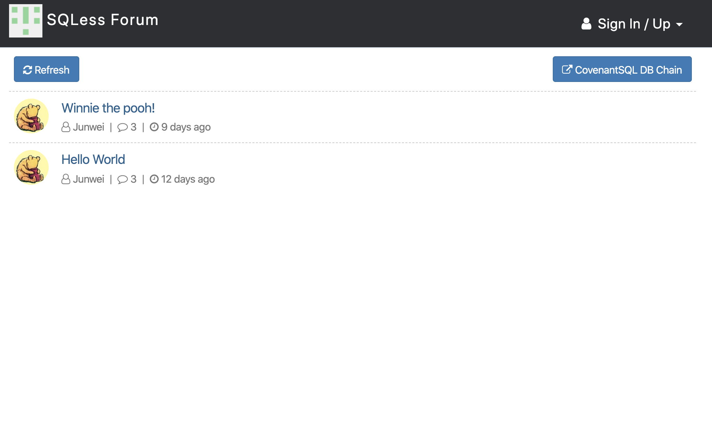

# SQLessForum

A simple **decentralized** forum powered by [SQLess](https://github.com/SQLess/SQLess).

## Decentralized forum ?

- Data and files are saved in **decentralized database**. Anyone with a permission granted private key and the DSN ( Database Serial Num ) can serve the forum anywhere.
- Also, all posts related data are saved on an unique `SQLChain Block` like [this](http://node9.puyuma.org:11108/dbs/37327dc31e008fcb623021d9712024a663093fcb736abf8f85b6befe7b1788e7/blocks/).

## Features

- Static files and database are powered by decentralized database: SQLess.
- REST API backend written in Go
- Vue.js-based frontend
- Social login (OAuth 2.0) via three providers:
  - Google
  - Facebook
  - Github
- JSON Web Tokens (JWT) are used for user authentication in the API
- Single binary deploy. All the static assets (frontend JavaScript & CSS files) are embedded into the binary
- Markdown comments
- Avatar upload, including animated GIFs. Auto-generated letter-avatars on user creation

## Screenshots



## Create your new Forum

1. Download and compile the forum binary:

```
$ go get -u  github.com/SQLess/SQLessForum/cmd/forum
```

2. Inside an empty directory run:

```
$ forum init
```

This will generate an initial configuration file "forum.conf" inside the current dir.
Edit the configuration file to set the server listen address, the base url, the database and file storage parameters, OAuth credentials, etc.

3. Fill in `file_storage` and `store` in the forum.conf:

```
file_storage {
  type = "covenant_s3"
  covenant_s3 {
    database  = "covenantsql://e08d944b4ebd69e12aa69..."
    config    = "config.yaml"
    masterkey = ""
  }
}

store {
  type = "covenantsql"
  covenantsql {
    database  = "covenantsql://e08d944b4ebd69e12aa69..."
    config    = "config.yaml"
    masterkey = ""
  }
}
```

4. Run the following command to start the forum web server.

```
$ forum start
```

5. Sign in into your web application using one of the social login providers.
   Then run the following command to grant admin privileges to your user.

```
$ forum add-admin <your-username>
```

## License

- SQLessForum is derived from a simple traditional forum [disintegration/bebop](https://github.com/disintegration/bebop), but SQLessForum has a totally different purpose. So, we just create a new project.
